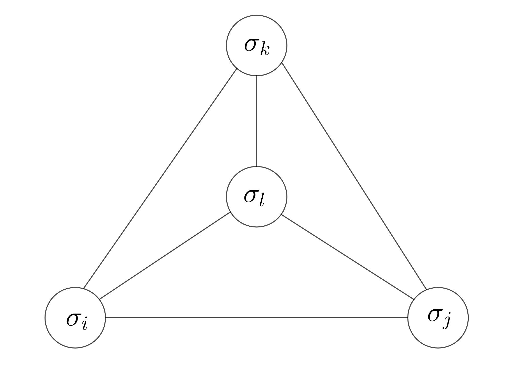
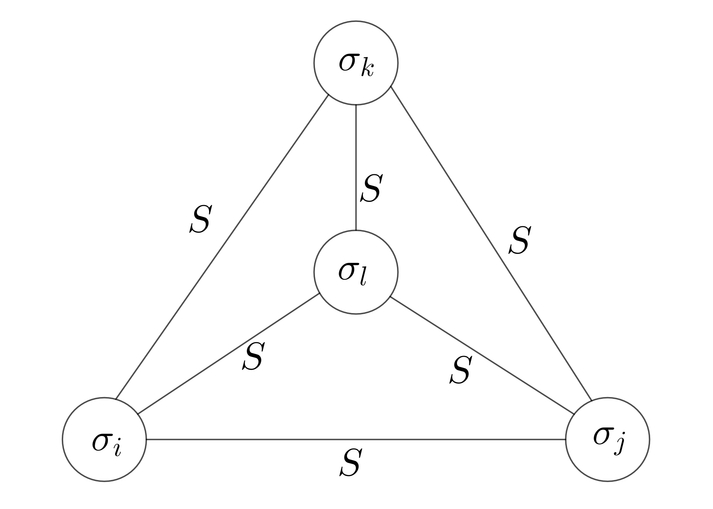
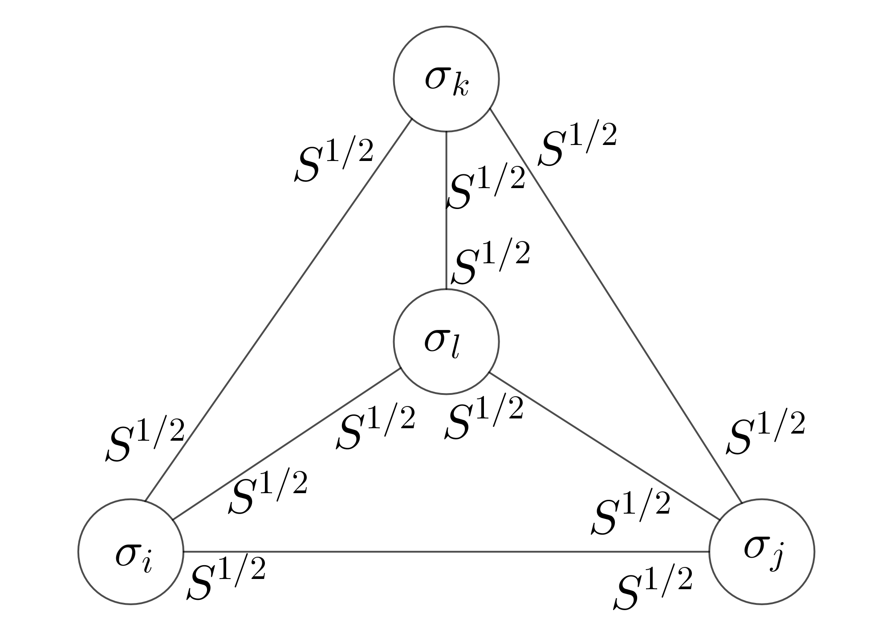
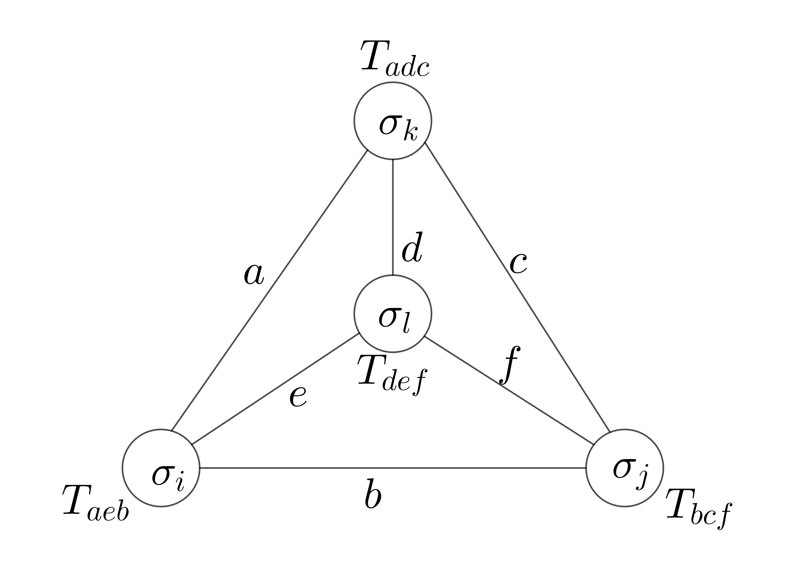
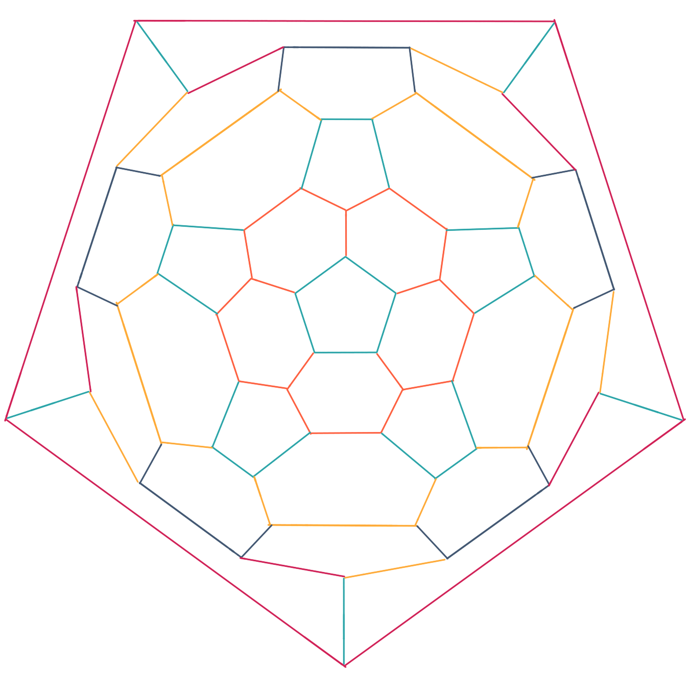
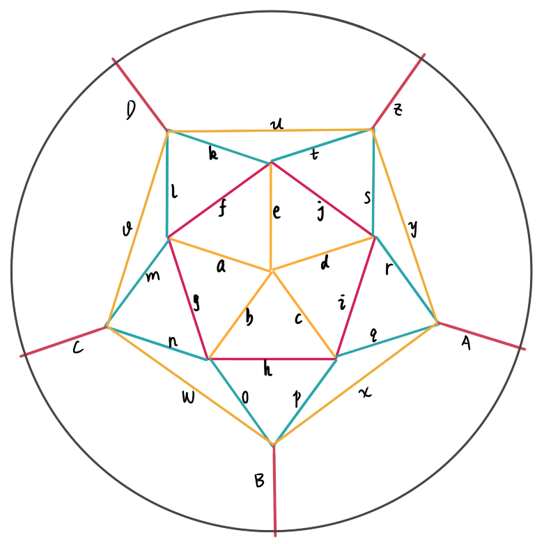

# Model

Anitferromagnetic Ising model Hamiltonian
$$
H = \sum_{\langle i,j\rangle} \sigma_i \sigma_j
$$

density operator

$$
\hat{\rho} = e^{- \beta H} =e^{- \beta \sum_{\langle i,j\rangle} \sigma_i \sigma_j}
$$


$$
\begin{array}{ccc}
            & \sigma_j =\uparrow  & \sigma_j =\downarrow  \\
            \\ \hline
             \sigma_i = \uparrow& e^{-\beta}  & e^{\beta} \\
             \sigma_i = \downarrow&e^{\beta}  & e^{-\beta}  
\end{array}
$$

$$
S = \pmatrix{ e^{-\beta}  & e^{\beta} \\
              e^{\beta}  & e^{-\beta}  }
$$

$$
Z_{ij} =\mathrm{Tr} [ e^{-\beta H} ]= \sum_{ij}S_{ij}
$$


# 3 lattice

$$
Z_{ijk} = \sum_{ijk}S_{ij}S_{jk}S_{ki}
$$


# 4 lattice

$$
Z_{ijkl} = \sum_{ijkl} S_{ij} S_{jk} S_{ki} S_{li} S_{lj} S_{lk}
$$



# 变换

$$
S^{1/2} \cdot S^{1/2} = S
$$

$$
S_{ik} = \sum_j S^{1/2}_{ij} \cdot S^{1/2}_{jk}
$$

## 求法

若
$$
A = V \Lambda V^{-1}
$$
则
$$
A^{1/2} = V \Lambda^{1/2} V^{-1}
$$

# Tensor

$$
T^k_{adc} = \sum_{k}S^{1/2}_{ka} S^{1/2}_{kd} S^{1/2}_{kc}
$$

$$
Z = \sum_{abcdef} T_{adc}T_{aeb} T_{bcf} T_{def}
$$

partition functiom

$$
Z(\beta) = \mathrm{Tr}\hat{\rho}
$$

<table>
  <tr>
    <td></td>
    <td></td>
    <td></td>
  </tr>
</table>


```python
"""
This is a triangle lattice of Ising model.
Using tensor network method to get the partition, ground state energy
and degeneracy of ground state energy.
In addition, also calculate the exact partition function.
"""


import numpy as np
import torch
from scipy import gradient
from scipy.linalg import sqrtm
from torch.autograd import Variable
from matplotlib import pyplot as plt


# define a function: compute the value of derivetive of function f(x)
# at x = a. Number of setps is N, and compute in the region [a-l, a+l]
def mydiff(f,a, N = 1e3, l = 1e-2):
    s = 2*l/N
    x = np.linspace(a-l,a+l,N)
    fun = np.linspace(0,0,N)
    for i in range(int(N)):
        fun[i] = f(x[i])
    d = gradient(fun,s)
    d = d[int(N)//2]
    return d

beta = 100


# compute the partition function Z
def getZ(beta,mu=0):
    B = np.array([ [np.exp(-beta), np.exp(beta)],
                       [np.exp(beta), np.exp(-beta)] ])
    B = B*np.exp(beta*mu)
    A1 = torch.tensor(B)

    Z = torch.einsum('ij,jk,ki->',A1,A1,A1)
    Z = Z.numpy()
    return Z

print('Z=',getZ(beta))

# compute lnZ
def lnZ(beta):
    Z = getZ(beta)
    Z = np.log(Z)
    return Z

# when 1 is negleticable compare to beta, E is the ground state energy.
E0 = -mydiff(lnZ, beta, N = 1e2, l = 1e-4)
#E0 = np.around(E0)
print('E0 = ',E0)
#print('zzdaf', lnZ(.999))


mu = -1/3
# whe mu is equal to groud state energy E0/number of interaction
def Deg(beta,mu=mu):
    Deg = getZ(beta,mu=mu)
    return Deg

print('degeneracy is',Deg(beta))

ZZ = (2*np.exp(-3*beta) + 6*np.exp(beta) )#*np.exp(-100)
print('exact partition function is', ZZ)

```

    Z= 1.6128702850896815e+44
    E0 =  -1.0101010126106758
    degeneracy is 6.000000000000087
    exact partition function is 1.6128702850896815e+44


    /usr/lib/python3.7/site-packages/ipykernel_launcher.py:21: DeprecationWarning: object of type <class 'float'> cannot be safely interpreted as an integer.
    /usr/lib/python3.7/site-packages/ipykernel_launcher.py:22: DeprecationWarning: object of type <class 'float'> cannot be safely interpreted as an integer.


<table>
  <tr>
    <td></td>
    <td></td>
  </tr>
</table>


```python
"""
This is a python3.7 code to calculate the ground state energy of a
Ising model of C60 using tensor network method
copyright: Copyright 2019 by ZQW.
license: MIT
"""

import numpy as np
from scipy.linalg import sqrtm

def mydiff(f,a,b,N):
    """
    get the derivative of function
    f: the input function
    N: calculate the derivatives of function f at N points in [a, b]
    return: N derivatives of function f
    """
    fx = np.zeros(N)
    s = (b-a)/(N-1)
    d = np.zeros(N-1)
    for i in range(N):
        x = a+i*s
        fx[i] = f(x)
        print('f(',x,')=',fx[i])
        if i>0:
            d[i-1] = ( fx[i] - fx[i-1] ) /s
            print('f\' between',x,'and',x-s,'is',d[i-1])
    return d

def getlnZ(beta):
    S = np.array([ [np.exp(-beta), np.exp(beta)],\
                   [np.exp(beta), np.exp(-beta)]]) # the S matrix
    # between two lattice
    S = sqrtm(S)
    T = np.einsum('ij,ik,il->jkl',S,S,S) # the 3-tensor at each lattice
    T = np.einsum('iae,jab,kbc,lcd,mde->ijklm',T,T,T,T,T) # the
    # 5-tensor at each lattice of a icosahedron after contraction of 12 pentagon
    Z = np.einsum('abcde,kfejt,jdirs,ciqph,hongb,mgafl,\
                   ABCDz,Ayrqx,Bxpow,Cwnmv,Dvlku,zutsy->'\
                   ,T,T,T,T,T,T,T,T,T,T,T,T) # contract the 12
    # lattices of the icosahedron to get the partition function of C60
    Z = Z.real
    lnZ = np.log(Z)             # the log of partition of C60
    return lnZ

E0 = - mydiff( getlnZ, 1,12,12) # according to statistical mechanics
# to get the energy. when temperature is 0, it is the ground state energy.
print(E0)
```

    f( 1.0 )= 78.4421074656477
    f( 2.0 )= 142.01437800946442
    f' between 2.0 and 1.0 is 63.57227054381673
    f( 3.0 )= 207.72503688198492
    f' between 3.0 and 2.0 is 65.7106588725205
    f( 4.0 )= 273.6863836975408
    f' between 4.0 and 3.0 is 65.96134681555588
    f( 5.0 )= 339.6811612250026
    f' between 5.0 and 4.0 is 65.99477752746179
    f( 6.0 )= 405.6804545976738
    f' between 6.0 and 5.0 is 65.99929337267122
    f( 7.0 )= 471.680358971803
    f' between 7.0 and 6.0 is 65.99990437412919


```python

```
